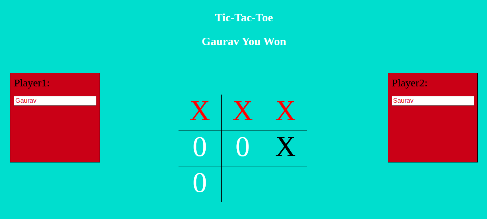

# Assignment_tictactoe

This assignment  was created  with vanilla Js.

## Overview of The Project:
Ticatactoe web app is a game where two machines play this game by clicking onrandom boxes and generating different results of winning and draw..

<a href =  "https://pandayzyx.github.io/Project_tictactoe/">
  <button style = "background:red,padding:5px">Demo Link</button>
</a>

  

